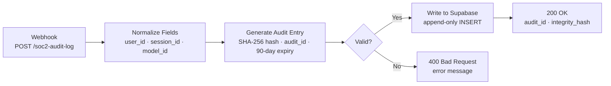
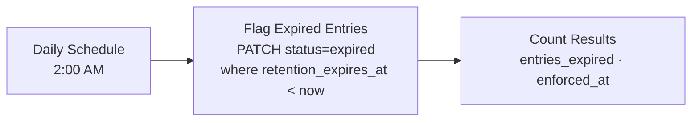

# AI Governance: SOC 2 Type II
### Audit Infrastructure for LLM Deployments

Practical audit infrastructure for deploying AI systems in SOC 2 Type II environments. Each artifact addresses a gap that standard SOC 2 guidance does not cover: what happens when an LLM is part of the system under audit, and how do you collect evidence that a QSA can evaluate.

Built for engineering and security teams at SaaS companies, financial services providers, and any organization whose SOC 2 scope includes an LLM-powered product or internal tool.

---

## The Problem

SOC 2 Type II assesses whether an organization's controls operated effectively over time. When AI systems are in scope, auditors ask two questions that most teams cannot answer:

1. Can you show what your AI systems did, and when?
2. Can you show that evidence has not been modified?

Standard n8n and LLM deployments have no built-in answer to either question. Interactions are ephemeral, logs are mutable, and retention is unmanaged. This repository implements the infrastructure to change that.

---

## Artifacts

| Artifact | Type | TSC | Status |
|----------|------|-----|--------|
| [Audit Log Pipeline](audit-log-pipeline/workflow.json) | n8n workflow | CC7.2, CC9.2 | Done |
| [Retention Enforcer](retention-enforcer/workflow.json) | n8n workflow | CC6.5 adjacent | Done |
| [SOC 2 AI Evidence Template](soc2-ai-evidence-template.md) | Document template | CC2.2, CC3.1 | Done |
| [TSC Reference](reference/soc2-trust-service-criteria.md) | Reference | All | Done |

---

## Audit Log Pipeline

**File:** [audit-log-pipeline/workflow.json](audit-log-pipeline/workflow.json)

A webhook-triggered n8n workflow that receives AI interaction events, validates required fields, generates a SHA-256 integrity hash, and writes an immutable audit entry to Supabase before returning the audit ID to the caller.

**What it logs per interaction:**
- `audit_id`: unique identifier returned to the caller for correlation
- `user_id`, `session_id`, `model_id`: interaction provenance
- `prompt`, `response`: full content (redact PII before logging if needed)
- `logged_at`: ISO timestamp from the caller or server-assigned
- `integrity_hash`: SHA-256 of the canonical payload; recompute to detect tampering
- `retention_expires_at`: 90 days from logged_at, used by the Retention Enforcer
- `status`: `active` or `expired`

**TSC coverage this workflow supports evidence for:**
- **CC7.2 (System Operations monitoring)**: provides a persistent, tamper-evident record of all AI interactions that auditors can review
- **CC9.2 (Risk Mitigation: vendor and business partner risk)**: documents the AI model used (model_id) and the full interaction for every call to a third-party model provider

**How to import:**
1. Download [audit-log-pipeline/workflow.json](audit-log-pipeline/workflow.json)
2. Open your n8n instance and click **+** (New Workflow) → **Import from file**
3. Create the Supabase table: see setup instructions in [audit-log-pipeline/README.md](audit-log-pipeline/README.md)
4. Replace `YOUR_SUPABASE_PROJECT_URL`, `YOUR_SUPABASE_ANON_KEY`, and `YOUR_SUPABASE_SERVICE_KEY` with your values
5. Add a header auth credential for the webhook API key
6. Activate the workflow

---

## Retention Enforcer

**File:** [retention-enforcer/workflow.json](retention-enforcer/workflow.json)

A daily scheduled n8n workflow that queries Supabase for active audit log entries past their 90-day retention window and updates their status to `expired`. Runs at 2:00 AM. Returns a count of entries flagged per run.

**TSC coverage this workflow supports evidence for:**
- **CC6.5 (Logical access controls: discontinuation)**: demonstrates that audit log data has a managed lifecycle rather than indefinite retention, supporting least-privilege and data minimization arguments

**Note:** The `expired` status is a flag, not a deletion. Immutability is enforced at the Supabase RLS layer (INSERT only, no UPDATE or DELETE from application layer). Set that up before activation.

---

## SOC 2 AI Evidence Template

**File:** [soc2-ai-evidence-template.md](soc2-ai-evidence-template.md)

A structured Markdown template for documenting an AI system for SOC 2 audit purposes. Covers: system description, trust service criteria mapping, access control log, incident record, model change log, and audit review schedule.

**TSC coverage this template supports evidence for:**
- **CC2.2 (Internal communication)**: structured documentation of AI system controls communicates internally how the system operates and what risks it carries
- **CC3.1 (Risk assessment objectives)**: the criteria mapping section documents which TSC apply to the AI system and how the organization's controls address them

Fill in one template per AI system in scope. Update it when the system, its controls, or the model changes. Keep it version-controlled.

---

## Honest Framing

These artifacts implement audit infrastructure, not SOC 2 compliance. Formal SOC 2 Type II compliance requires:

1. An independent assessment by a licensed CPA firm with SOC 2 attestation capability
2. A defined trust service criteria scope agreed with auditors
3. Operating effectiveness over a defined audit period (typically 6 or 12 months)
4. Controls across all five trust service categories in scope (at minimum: Security)

What these artifacts provide: the raw evidence infrastructure that an AI system in SOC 2 scope would need to produce. An auditor reviewing CC7.2 can pull the audit log and verify interactions were captured. An auditor reviewing CC9.2 can confirm the model_id field documents which vendor's model was used. The evidence does not generate itself — these workflows create it.

**Reference labeling:** Real-world references in this repository are labeled. **[Confirmed]**: a documented public incident with a verifiable outcome. **[Technique]**: an attack method described in security research. **[Scenario]**: a constructed example based on known failure modes in the domain.

---

## Related

- [ai-governance-owasp10](https://github.com/nenedesign/ai-governance-owasp10): OWASP LLM Top 10 v2.0 implementations
- [ai-governance-pci-dss](https://github.com/nenedesign/ai-governance-pci-dss): PCI-DSS v4.0 cardholder data protection at the LLM inference layer

---

## License

MIT License. See [LICENSE](LICENSE).

---

## About

Built by [Neville Ko](https://www.linkedin.com/in/nevilleko/) · [GitHub](https://github.com/nenedesign), AI Product Manager, Designer & Builder at [Distinct AI](https://www.fromus.ca/ai-builds).
